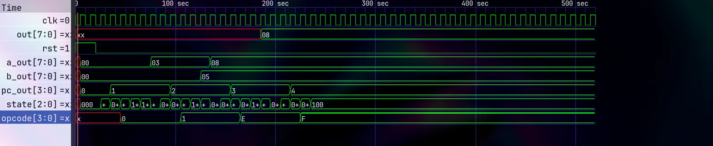

# SAP-1 8-bit CPU in Verilog

A complete implementation of the SAP-1 
(Simple As Possible) 8-bit CPU architecture 
in Verilog HDL, simulated and verified using 
Icarus Verilog and GTKWave.

## Architecture

[architecture](Diagram/Diagram.png)

The SAP-1 is an 8-bit CPU with a shared bus 
architecture consisting of 8 modules connected 
via a single 8-bit bus controlled by the 
Control Unit.

## Modules

| Module | File | Description |
|--------|------|-------------|
| ALU | ALU.v | Performs ADD and SUB |
| Accumulator | Register.v | 8-bit A register |
| B Register | Register.v | ALU operand register |
| Program Counter | PC.v | 4-bit PC with increment |
| MAR | MAR.v | Memory Address Register |
| RAM | RAM.v | 16x8 program memory |
| IR | IR.v | Instruction Register |
| Output Register | OR.v | Latches result to LEDs |
| Control Unit | CU.v | FSM, 6 states T1-T6 |

## ISA

| Instruction | Opcode | Hex | Operation |
|-------------|--------|-----|-----------|
| LDA x | 0000 | 0x | A ← RAM[x] |
| ADD x | 0001 | 1x | A ← A + RAM[x] |
| SUB x | 0010 | 2x | A ← A - RAM[x] |
| OUT | 1110 | Ex | Output ← A |
| HLT | 1111 | Fx | Stop CPU |

## Simulation Result

CPU executes LDA 15, ADD 14, OUT, HLT
Result: 3 + 5 = 8 

## How to Simulate

### Requirements
- Icarus Verilog
- GTKWave

### Install (Arch Linux)
pacman -S iverilog gtkwave

### Run
iverilog -o sap1 src/testbench.v src/SAP-1.v 
src/ALU.v src/PC.v src/MAR.v src/RAM.v 
src/IR.v src/Register.v src/OR.v src/CU.v

vvp sap1
gtkwave sap1.vcd

## Next Steps
- Synthesize for Tang Nano 9K FPGA
- Display result on onboard LEDs
- Add physical switches for reset
- Python assembler for .asm files

## Tools Used
- Verilog HDL
- Icarus Verilog
- GTKWave
- Gowin EDA (upcoming FPGA synthesis for tangnano9k board)

## Reference
- SAP-1 Architecture: Malvino & Brown
  "Digital Computer Electronics"
- HDLBits for Verilog practice
- Harris & Harris 
- Ben Eater 8-bit CPU series (YouTube)
